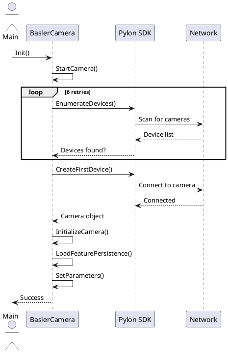

# GitLab Duo Chat Workflow Guide

## Overview

GitLab Duo Chat is a powerful AI-powered assistant integrated directly into GitLab that can significantly enhance your daily development workflow. This guide demonstrates practical use cases and provides real examples from the Adaptio project.

**Access GitLab Duo Chat**: Click the chat icon in the GitLab interface (top right corner) or use it directly on MRs, commits, and pipelines.

---

## 1. MR Review Automation

### Use Case

Quickly understand the scope, impact, and quality of changes in a merge request without manually reading all the code.

### How It Works

1. Open a merge request in GitLab
2. Click the chat icon or open GitLab Duo Chat
3. Ask questions like:

   - "Explain the major changes in this MR"
   - "What are the potential risks in these changes?"
   - "Are there any code quality issues?"
   - "Does this follow the project's patterns?"

### Real Examples from Adaptio

#### Example 1: Thread Monitor Implementation

**MR**: [!1004 - fix: Thread monitor](https://gitlab.com/esab/abw/adaptio/-/merge_requests/1004)

**What Duo Chat Can Do**:

- Summarize the heartbeat registry implementation
- Identify the monitor thread polling strategy
- Highlight potential issues (aggressive SIGABRT, hardcoded timeouts)
- Suggest improvements (exponential backoff, configurable thresholds)

**Sample Questions**:

```text
"Explain why there are more than 600k lines changed in this MR"
"What are the thread safety concerns in this implementation?"
"How does the monitor thread detect hangs?"
```

#### Example 2: Gen 2 Architecture Changes

**MR**: [!1020 - feat: Adaptio changes for Gen 2](https://gitlab.com/esab/abw/adaptio/-/merge_requests/1020)

**What Duo Chat Can Do**:

- Identify the architectural shift from protobuf to JSON-based messaging
- Explain the new data structures (SystemControl, WeldControl, etc.)
- Highlight the separation of concerns
- Map old vs. new communication patterns

**Sample Questions**:

```text
"Explain the major changes implemented in this MR"
"What is the difference between Gen 1 and Gen 2 communication?"
"How does the WebHMI integration change the workflow?"
```

#### Example 3: FOV Reset Logic

**MR**: [!1012 - fix: Reset FOV when no surface](https://gitlab.com/esab/abw/adaptio/-/merge_requests/1012)

**What Duo Chat Can Do**:

- Explain the refactoring of FOV reset logic
- Identify the new counter mechanism for tracking surface detection failures
- Highlight the dual-trigger reset condition
- Suggest potential issues with error handling

**Sample Questions**:

```text
"Why was the FOV reset logic refactored?"
"What does the frames_without_surface counter track?"
"Are there any edge cases in the reset logic?"
```

---

## 2. Pipeline Failure Analysis

### Use Case

Quickly diagnose why a pipeline failed without manually searching through logs.

### How It Works

1. Open a failed pipeline in GitLab
2. Click on a failed job
3. Open GitLab Duo Chat
4. Ask about the failure:

   - "Why did this job fail?"
   - "What does this error message mean?"
   - "How can I fix this?"

### Real Examples from Adaptio

#### Example 1: Test Failure Analysis

**Commit**: [e6b1a671 - fix: JT-LW-Block-Test](https://gitlab.com/esab/abw/adaptio/-/commit/e6b1a67162a09037b0c4d4990cceeb68f1ae537f)

**What Duo Chat Can Do**:

- Analyze why `get_position()` returns 0 instead of the set value
- Identify the sequence transition issue
- Suggest debugging steps
- Explain the data flow through the system

**Sample Questions**:

```text
"Why does axis_x_output.get_position() return 0 when set to 1.23?"
"What happens during sequence transition from AUTO_WELDING to TRACKING?"
"How can I debug this position update issue?"
```

#### Example 2: Steady Clock Migration

**MR**: [!1016 - fix: Use steady clock](https://gitlab.com/esab/abw/adaptio/-/merge_requests/1016)

**What Duo Chat Can Do**:

- Explain why steady_clock is preferred over system_clock
- Identify all the places where clock types were changed
- Verify consistency across the codebase
- Suggest any missed conversions

**Sample Questions**:

```text
"Why are we migrating from system_clock to steady_clock?"
"Are there any timing-related issues this fixes?"
"Did we miss any clock conversions?"
```

---

## 3. Documentation Generation with PlantUML

### Use Case

Automatically generate architecture diagrams, sequence diagrams, and flowcharts from code analysis.

### How It Works

1. Ask Duo Chat to analyze code flow
2. Request PlantUML diagram generation
3. Duo Chat creates the diagram syntax
4. Embed in markdown documentation

### Real Examples from Adaptio

#### Example 1: Camera Startup Sequence

**Code Location**: `src/scanner/image_provider/src/basler_camera.cc`

**What Duo Chat Can Generate**:

- Sequence diagram showing camera initialization phases
- Retry logic visualization
- Network disturbance handling flow
- Reconnection mechanism timeline

**Sample Request**:

```text
"Create a PlantUML sequence diagram for the camera startup procedure
including device enumeration, acquisition, configuration, and error handling"
```

**Generated Diagram** (Example):



#### Example 2: Weld Start Workflow

**Code Location**: Multiple files (Main, Controller, PLC, Scanner, WeldControl)

**What Duo Chat Can Generate**:

- Complete weld start sequence from user action to active welding
- Heartbeat supervision loop
- Real-time feedback mechanisms
- Stop sequence

**Sample Request**:

```text
"Create a PlantUML sequence diagram for the complete weld start process
including WebHMI commands, controller coordination, PLC communication,
scanner integration, and continuous monitoring"
```

#### Example 3: Thread Monitor Architecture

**Code Location**: `src/common/zevs/src/eventloop_impl.cc` and related files

**What Duo Chat Can Generate**:

- Component interaction diagram
- Heartbeat registry mechanism
- Monitor thread polling strategy
- Hang detection and callback flow

**Sample Request**:

```text
"Create a PlantUML component diagram showing the thread monitor architecture
including EventLoop, HeartbeatRegistry, MonitorThread, and their interactions"
```

---

## 4. Project Manager Use Cases

### Use Case A: Sprint Planning & Risk Assessment

**Scenario**: PM needs to understand the scope and risk of upcoming features

**How Duo Chat Helps**:

1. Analyze related MRs to understand feature complexity
2. Identify dependencies and integration points
3. Assess technical debt and refactoring needs
4. Estimate effort based on similar past work

**Example Questions**:

```text
"Based on the Gen 2 architecture changes, what are the main integration risks?"
"How much refactoring is needed to support dual power sources?"
"What are the critical path items for the camera startup improvements?"
```

### Use Case B: Quality Metrics & Code Health

**Scenario**: PM wants to track code quality trends and identify problem areas

**How Duo Chat Helps**:

1. Analyze test coverage changes
2. Identify recurring issues or patterns
3. Track refactoring efforts
4. Monitor technical debt

**Example Questions**:

```text
"What percentage of changes in this sprint are refactoring vs. new features?"
"Are there any critical areas with low test coverage?"
"What technical debt items are being addressed?"
```

### Use Case C: Stakeholder Communication

**Scenario**: PM needs to explain technical changes to non-technical stakeholders

**How Duo Chat Helps**:

1. Generate executive summaries of technical changes
2. Create visual diagrams for presentations
3. Identify business impact of technical decisions
4. Translate technical jargon to business language

**Example Questions**:

```text
"Summarize the Gen 2 changes in business terms for stakeholders"
"What are the user-facing benefits of the thread monitor implementation?"
"How does the steady clock migration improve system reliability?"
```

### Use Case D: Dependency & Integration Tracking

**Scenario**: PM needs to understand feature dependencies and integration points

**How Duo Chat Helps**:

1. Map feature dependencies across components
2. Identify integration test requirements
3. Track cross-team dependencies
4. Plan release coordination

**Example Questions**:

```text
"What components need to be updated for Gen 2 support?"
"Which teams need to coordinate on the camera startup improvements?"
"What are the integration points between scanner and weld control?"
```

---

## Best Practices

### 1. Be Specific

✅ **Good**: "Explain the heartbeat supervision mechanism and identify potential race conditions"

❌ **Bad**: "Tell me about this code"

### 2. Provide Context

✅ **Good**: "In the context of Gen 2 hardware, explain how the new SystemControl message differs from the old AdaptioInput"

❌ **Bad**: "What changed?"

### 3. Ask Follow-up Questions

✅ **Good**: Ask clarifying questions to drill deeper into specific areas

❌ **Bad**: Accept the first answer without verification

### 4. Use for Verification

✅ **Good**: "Does this implementation follow the project's error handling patterns?"

❌ **Bad**: Rely solely on Duo Chat without code review

### 5. Combine with Manual Review

✅ **Good**: Use Duo Chat to understand scope, then manually review critical sections

❌ **Bad**: Replace code review with Duo Chat analysis

---

## Quick Reference: Common Questions by Role

### For Developers

- "Explain the changes in this MR and identify potential issues"
- "Why did this pipeline job fail?"
- "Create a sequence diagram for this workflow"
- "Does this follow the project's patterns?"
- "What are the thread safety concerns here?"

### For Code Reviewers

- "Summarize the major changes in this MR"
- "What are the risks in this implementation?"
- "Are there any edge cases not handled?"
- "How does this impact other components?"
- "What tests should be added?"

### For Project Managers

- "What is the scope and complexity of this feature?"
- "What are the integration dependencies?"
- "Summarize this technical change for stakeholders"
- "What is the estimated effort based on similar work?"
- "What are the critical path items?"

### For QA/Test Engineers

- "What test scenarios should cover this change?"
- "What are the edge cases in this implementation?"
- "Create a test plan for this feature"
- "What integration tests are needed?"
- "What are the failure modes?"

---

## Real MR Examples for Reference

### High-Impact Architectural Changes

- [!1020 - feat: Adaptio changes for Gen 2](https://gitlab.com/esab/abw/adaptio/-/merge_requests/1020) - Major architecture refactoring
- [!1004 - fix: Thread monitor](https://gitlab.com/esab/abw/adaptio/-/merge_requests/1004) - New monitoring infrastructure

### Bug Fixes & Improvements

- [!1012 - fix: Reset FOV when no surface](https://gitlab.com/esab/abw/adaptio/-/merge_requests/1012) - Logic refactoring
- [!1016 - fix: Use steady clock](https://gitlab.com/esab/abw/adaptio/-/merge_requests/1016) - Consistency improvements

### Test & Documentation

- [e6b1a671 - fix: JT-LW-Block-Test](https://gitlab.com/esab/abw/adaptio/-/commit/e6b1a67162a09037b0c4d4990cceeb68f1ae537f) - Test failure analysis

---

## Getting Started

1. **Open GitLab**: Navigate to any MR, commit, or pipeline
2. **Click Chat Icon**: Look for the chat icon in the top right
3. **Ask a Question**: Start with one of the examples above
4. **Iterate**: Ask follow-up questions to drill deeper
5. **Share Results**: Copy diagrams and summaries to documentation

---

## Tips for Maximum Effectiveness

### For MR Reviews

- Ask Duo Chat to summarize before reading the code
- Use it to identify potential issues
- Verify its analysis with manual review
- Ask about patterns and best practices

### For Pipeline Failures

- Paste error messages and ask for interpretation
- Ask for step-by-step debugging guidance
- Request similar past issues for comparison
- Ask for preventive measures

### For Documentation

- Request PlantUML diagrams for complex flows
- Ask for executive summaries
- Generate test plans and checklists
- Create architecture documentation

### For Project Management

- Use for sprint planning and estimation
- Track technical debt and quality metrics
- Communicate technical changes to stakeholders
- Identify dependencies and risks

---

## Limitations & Considerations

⚠️ **Important**: GitLab Duo Chat is an AI assistant and should not replace:

- Thorough code review
- Security analysis
- Performance testing
- Manual verification

✅ **Best Used For**:

- Understanding code scope and impact
- Generating documentation and diagrams
- Identifying potential issues
- Explaining complex systems
- Accelerating analysis and planning

---

## Feedback & Improvements

If you discover new use cases or have suggestions for improving this guide, please:

1. Create an issue with your findings
2. Share examples in team discussions
3. Update this guide with new patterns

---

**Last Updated**: 2026-02-17
**Version**: 1.0
