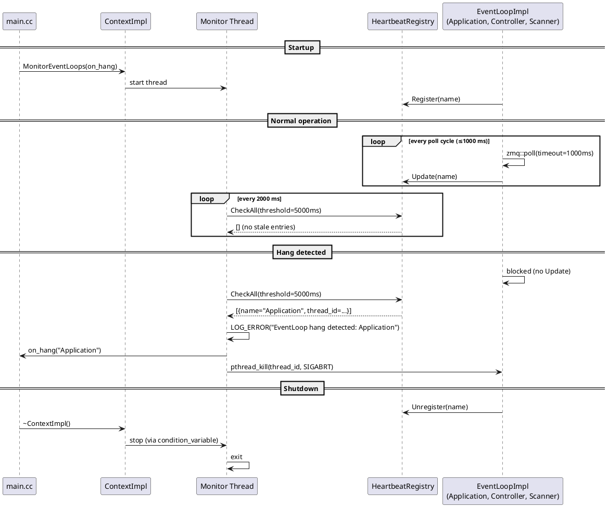

# EventLoop Thread Monitor

## Overview

The thread monitor detects hung EventLoops by tracking heartbeat timestamps.
A dedicated monitor thread periodically checks if any EventLoop has stopped
updating its heartbeat, indicating it is blocked or deadlocked.

## Components

| Component | Location | Role |
|---|---|---|
| `HeartbeatRegistry` | `zevs/src/heartbeat_registry.h` | Thread-safe map of EventLoop names to heartbeat timestamps and `pthread_t` handles |
| `ContextImpl` | `zevs/src/process_impl.h` | Owns the registry and the monitor thread |
| `EventLoopImpl` | `zevs/src/eventloop_impl.cc` | Registers, updates heartbeat on each poll cycle, unregisters on exit |
| `main.cc` | `src/main.cc` | Configures the hang callback (logs the hung EventLoop name) |

## Timing parameters

| Parameter | Value | Description |
|---|---|---|
| Poll timeout | 1000 ms | Max time an EventLoop blocks in `zmq::poll` before updating its heartbeat |
| Check interval | 2000 ms | How often the monitor thread checks for stale entries |
| Stale threshold | 5000 ms | A heartbeat older than this is considered hung |

The poll timeout must be less than the stale threshold to avoid false positives.

## Sequence

