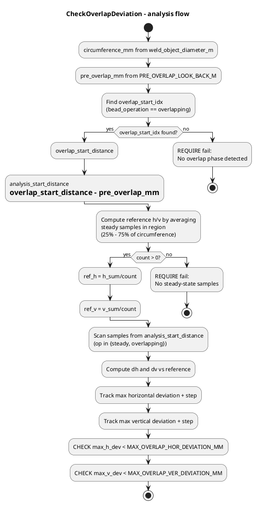

# ABP Test

## Test suite and location

- **Suite**: `ABPTests`
- **Case**: `track_steady_during_overlap`
- **File**: `abp_test.cc`
- **Analysis**: `CheckOverlapDeviation(...)` in the same file

## What the test verifies

The test runs **one bead** in ABP mode (after starting JT → ABP),
records torch position samples during the bead,
detects the start of the **overlap phase**,
and asserts that torch deviation in the overlap zone
stays below `MAX_OVERLAP_HOR_DEVIATION_MM` (horizontal)
and `MAX_OVERLAP_VER_DEVIATION_MM` (vertical).

## Physical background

- Wall angle: 30° (60° V-bevel, each side 30°)
- Bead height at overlap: ~3 mm
- Expected ABW horizontal shift:
  `3 × tan(30°) ≈ 1.7 mm`
- Groove locking activates 100 mm before overlap
  (`PRE_OVERLAP_LOOK_BACK_M`)
  to freeze the tracking reference
- The torch must stay steady horizontally
  despite the ABW shift

## Example output and pass/fail criteria

### Passing test (typical)

```text
Steady-state reference: h=15.821 mm, v=-12.278 mm (100 samples)
Overlap starts at step 202 (dist=6346.0 mm)
analysis from 6246.0 mm
  step=199 dist=6252 op=steady      dh=0.00 dv=0.00
  step=200 dist=6283 op=steady      dh=0.00 dv=1.06
  step=201 dist=6315 op=steady      dh=0.00 dv=2.92
  step=202 dist=6346 op=overlapping dh=0.00 dv=3.10
=== Max horizontal deviation: step=199, dh=0.00 mm ===
=== Max vertical deviation: step=202, dv=3.10 mm ===

PASS: dh (0.00)
      < MAX_OVERLAP_HOR_DEVIATION_MM (2.0)
PASS: dv (3.10)
      < MAX_OVERLAP_VER_DEVIATION_MM (4.0)
```

### Failing test (what drift would look like)

```text
  step=199 dist=6252 op=steady      dh=0.50 dv=0.00
  step=200 dist=6283 op=steady      dh=1.20 dv=1.06
  step=201 dist=6315 op=steady      dh=2.10 dv=2.92
  step=202 dist=6346 op=overlapping dh=2.50 dv=4.50
=== Max horizontal deviation: step=202, dh=2.50 mm ===
=== Max vertical deviation: step=202, dv=4.50 mm ===

FAIL: Horizontal torch deviation 2.50 mm at step 202
      exceeds 2.0 mm
FAIL: Vertical torch deviation 4.50 mm at step 202
      exceeds 4.0 mm
```

- `dh` growing toward 2+ mm
  means the torch is chasing the ABW1/ABW5 shift
  caused by the overlap bead sitting on the wall
- This indicates groove locking
  is not fully preventing wall drift

## Summary of thresholds

### Horizontal deviation (`dh`)

- Threshold: < 2.0 mm (`MAX_OVERLAP_HOR_DEVIATION_MM`)
- Must stay below expected ~1.7 mm ABW shift
- Tracking must not follow the wall shift

### Vertical deviation (`dv`)

- Threshold: < 4.0 mm (`MAX_OVERLAP_VER_DEVIATION_MM`)
- Allows for expected vertical step-up (~3 mm)
  during overlap behavior

## Test flow

### Flow chart (overlap deviation analysis)



## Key parameters

### Joint geometry (`TEST_JOINT_GEOMETRY_SHALLOW`)

- Upper joint width: 57.58 mm
- Groove depth: 12.25 mm
- Wall angle: 30° (0.5236 rad) per side
- Basemetal thickness: 49 mm
- Joint depth percentage: 25%
- Weld object diameter: 2.0 m

### Analysis constants

#### NUMBER_OF_STEPS_PER_REV

- Value: 200
- Steps per full rotation

#### PRE_OVERLAP_LOOK_BACK_M

- Value: 0.10 m (100 mm)
- Distance before overlap start
  to include in analysis

#### MAX_OVERLAP_HOR_DEVIATION_MM

- Value: 2.0 mm
- Maximum allowed horizontal torch drift

#### MAX_OVERLAP_VER_DEVIATION_MM

- Value: 4.0 mm
- Maximum allowed vertical torch drift

#### Steady-state window

- Start: 25% of circumference (`STEADY_STATE_REGION_START`)
- End: 75% of circumference (`STEADY_STATE_REGION_END`)
- Region for computing reference position

## Relation to production observations

This test was created based on LP04 gantry test welding observations
(weld 260801, week 08/2026).

Overlap-induced wall drift was observed
at bead shift points (beads 8 and 22).

The torch was not held steady horizontally
before shifting sides,
causing drift toward the groove wall
during the overlap transition.
