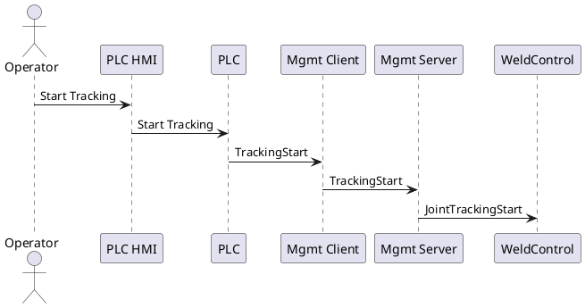
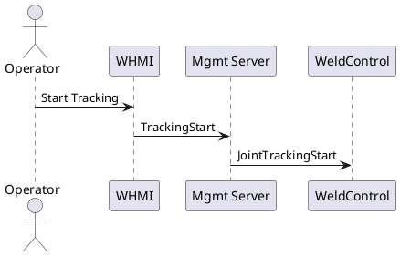

# Definition

This document describes the control flow differences between legacy and Gen2 systems for starting joint tracking.

# Legacy Control Flow

The sequence below shows the legacy control flow for starting joint tracking

# Gen2 Control Flow

The sequence below shows the Gen2 control flow for starting joint tracking

