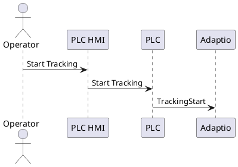
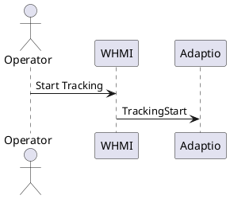

# Definition

This document describes the top-level control flow differences between legacy and Gen2 systems for starting joint tracking. Internal Adaptio components (Management Server, Management Client, WeldControl) are shown as a single "Adaptio" participant.

# Legacy Control Flow

The sequence below shows the legacy control flow for starting joint tracking

# Gen2 Control Flow

The sequence below shows the Gen2 control flow for starting joint tracking

