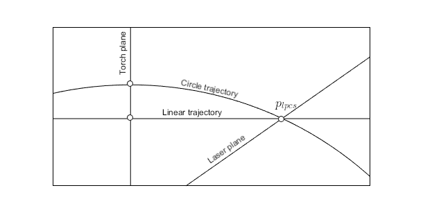

# Slice translation

The process of predicting where a point in the laser plane will pass through the torch plane during welding. Or the inverse.

## Translation models

The translation models act as a facade between the WeldMotionContext and e.g. the CalibrationHandlers and the SliceTranslatorService. The TranslationModel implementations do mainly the following coordination:

- Updates the transformer with new torch translation (slide position)
- Delegates to the WeldMotionContext to perform the transformations needed and the weld motion prediction (trajectory)
- When activated, passes itself to SliceTranslatorService to be used as the active translation model.

The reason for having separate implementations for CW and LW is partly that only the CW translation model should implement extra methods from OptimizableModel interface and thereby be callable from the CalibrationSolver.

All (currently two) translation models share the same instance of SliceTranslatorService and WeldMotionContext. When a translation model is activated it passes itself to the SliceTranslatorService in SetActiveModel(TranslationModel) and its corresponding trajectory to the WeldMotionContext. By doing so, the whole system is reconfigured to handle a different type of weld movement.

## Transformer

The LpcsToMacsTransformer is responsible for performing pure coordinate transformations between LPCS and MACS. No motion is modelled here. LpcsToMacsTransformer implements a "configuration" interface (intended to be called by translation models, which only do configuration) and a "execution" interface (intended to be used by the WeldMotionContext for back and forth transformations).

## Weld motion context

The purpose of the weld motion context is to handle the transformation and prediction logic that does not depend on weld motion type (LW/CW). The intent is to avoid duplication of this logic in the different TranslationModels and make it fully trajectory independent. The weld motion context relies on abstract Trajectories to predict how a point on the weld object will move and eventually intersect the torch or laser plane. The active trajectory (strategy) can be set/switched at run-time by the TranslationModels

## Trajectory

A trajectory represents the way in which a point moves relative to MACS during welding. It does not care if it is the weld object or the boom/weld head that is moving. It is all relative motion, only direction differs. The trajectory implementations contain the logic to compute intersection between trajectories and planes (laser or torch). Each translation model has its own trajectory which it can configure in a CW/LW dependent way. The WeldMotionContext uses the trajectory in a CW/LW agnostic way. If new types of weld movement actuators (in addition to roller-beds and boom) or new handling of eliptical objects etc. is desired, additional trajectories can be implemented and injected from composition root without the need to change clients, SliceTranslatorService or WeldMotionContext.



- A circle trajectory is defined by a rotation around a specified 3D axis.
- A linear trajectory is defined by a linear motion in a specified 3D direction.

## SliceTranslatorService

Acts a translation model type anonymizer to clients (typically CoodrinateTranslator --> WeldControl) that need to do translate slices. The service is just given an abstract TranslationModel that it calls to do the actual translations. All clients and the service itself remains unaware of whether a CW or LW model is used.

## Config and prediction sequences

Class/interface names in the diagrams are conceptual.
The following entities have different implementations for CW and LW:

- Trajectory
- TranslationModel
- CalibrationHandler

The following entities are LW/CW agnostic:

- SliceTranslatorService
- WeldMotionContext
- Transformer

### Config and activation sequence

```plantuml

'=== Set config ===

box "Weld motion dependent implementations"  #FFA
    participant CalibrationHandler
    participant TranslationModel 
    participant Trajectory
end box
box "Weld motion agnostic implementations" #0FF
    participant SliceTranslatorService
    participant WeldMotionContext
    participant Transformer
end box

    CalibrationHandler -> TranslationModel : ActivateWithConfig(WocData, LtcData)
    TranslationModel -> Transformer : SetTransformation(LtcData)
    TranslationModel -> Trajectory : Set(WocData)
    TranslationModel -> WeldMotionContext : SetActiveTrajectory(Trajectory)
    TranslationModel -> SliceTranslatorService : SetActiveModel(TranslationModel)
    
```

### Slice translation sequence

```plantuml
box "Predict MCS point from LPCS point"

    participant Client
    participant SliceTranslatorService
    participant TranslationModel 
    participant WeldMotionContext
    participant Trajectory
    participant Transformer

    Client -> SliceTranslatorService : LpcsToMcs(lpcs_points[], slide_pos)
    SliceTranslatorService -> TranslationModel : LpcsToMcs(lpcs_points[], slide_pos)
    TranslationModel -> Transformer : UpdateMacsToTcsTranslation(slide_pos)
    loop for each lpcs_point
        TranslationModel -> WeldMotionContext : IntersectTorchPlane(lpcs_point)
        WeldMotionContext -> Transformer : LpcsToMacs(lpcs_point)
        Transformer --> WeldMotionContext : macs_point
        WeldMotionContext -> Trajectory : AttachToPoint(macs_point)
        WeldMotionContext -> Trajectory : Intersect(torch_plane)
        Trajectory --> WeldMotionContext : mcs_point
        WeldMotionContext --> TranslationModel : mcs_point
        TranslationModel -> TranslationModel: push to return vector
    end

    TranslationModel --> SliceTranslatorService : mcs_points[]
    SliceTranslatorService --> Client : mcs_points[]
end box

```
