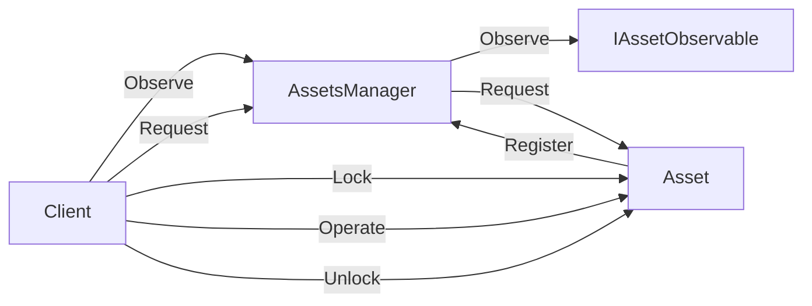
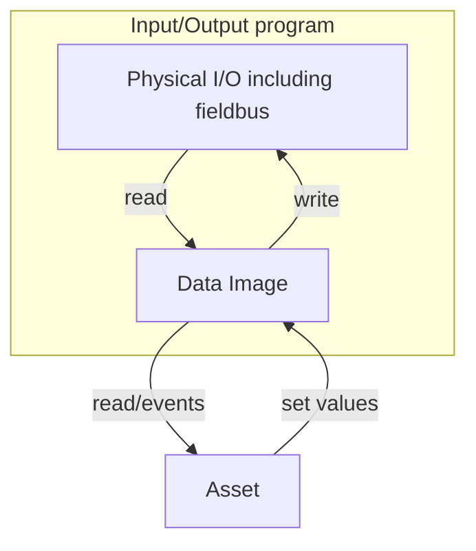
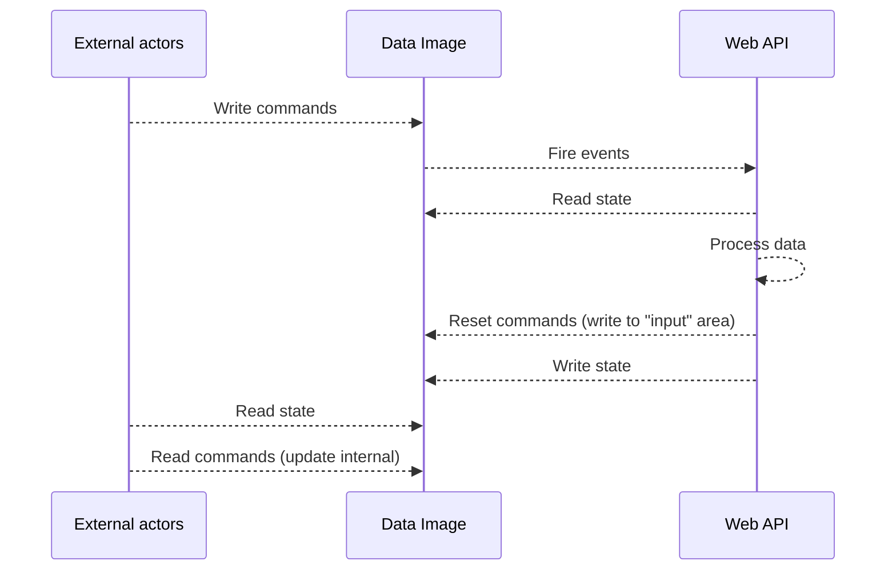
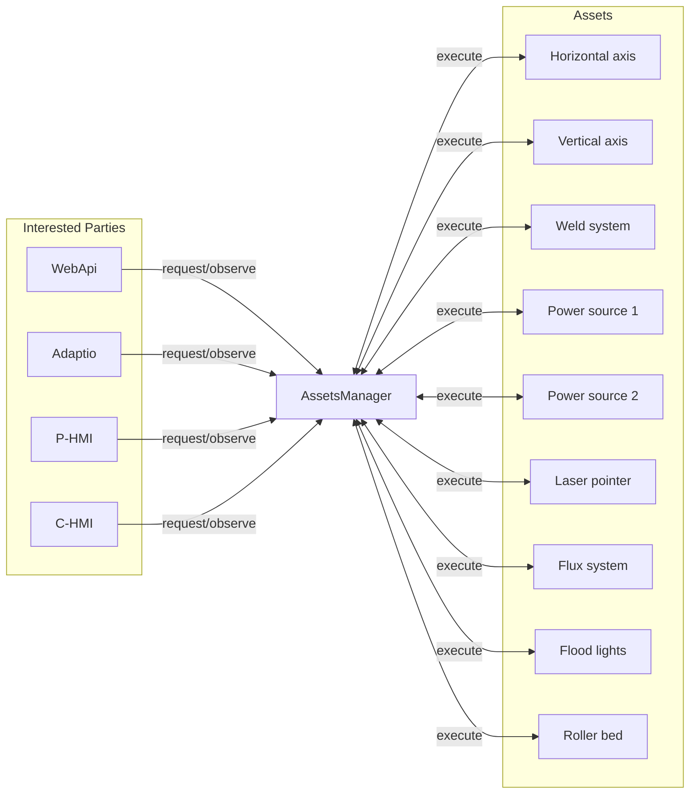
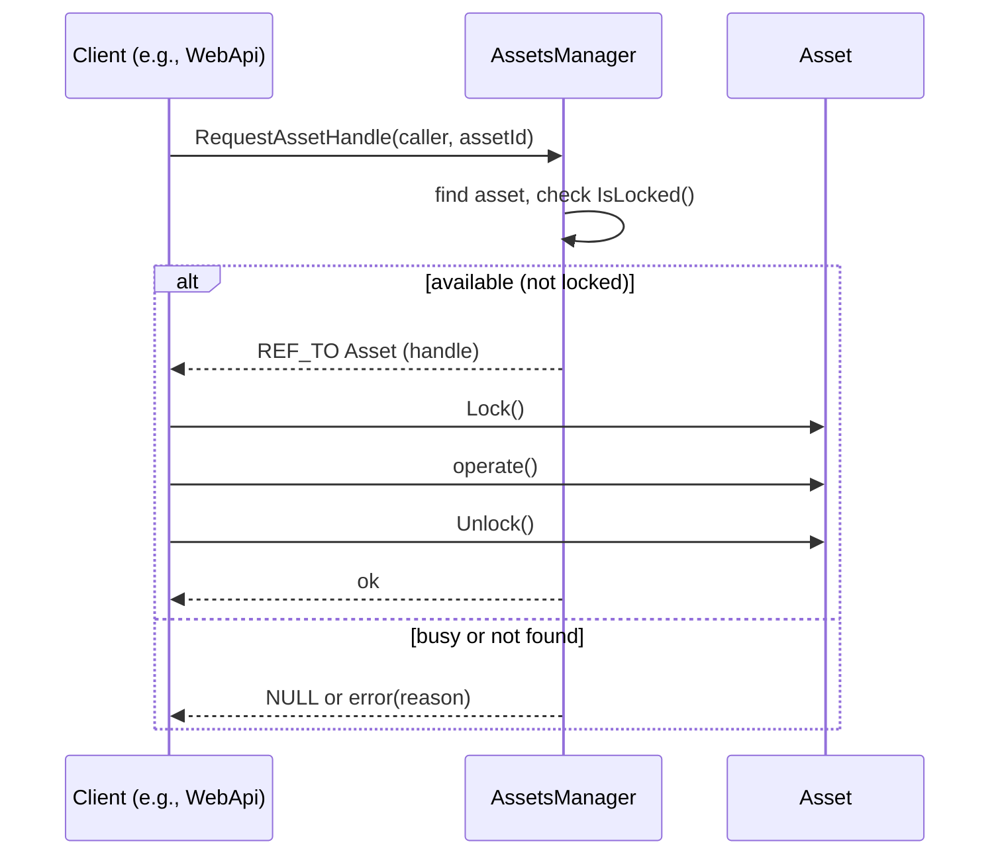
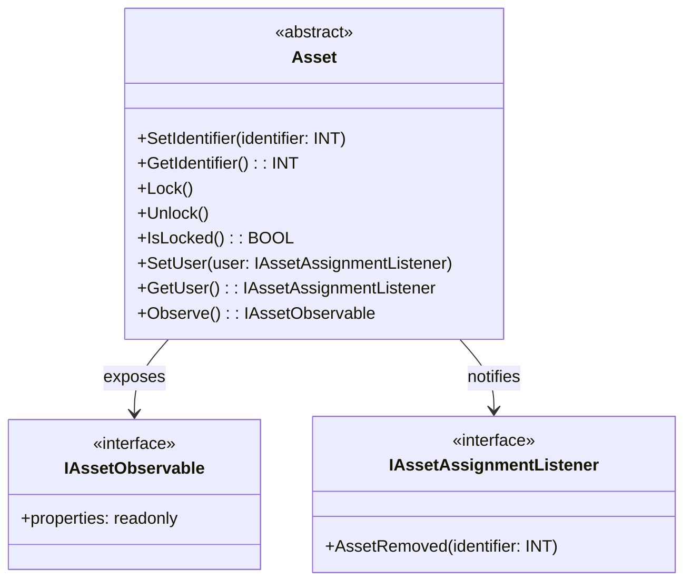
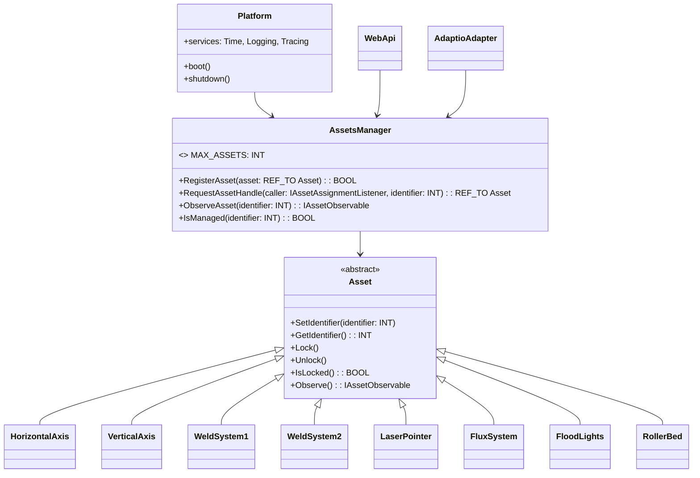

# AWS Platform Architecture Overview

This document describes the target software architecture as specified by the product owner and is aligned with the current Asset and AssetsManager interfaces found in src/Utils/Assets. Diagrams are provided using Mermaid.

## Hardware configuration

The hardware configuration is currently set up in a TIA Portal project, currently there are two hardware configuration projects:

- hardware-configurations/aws-platform-base.zap20
- hardware-configurations/aws-platform-hil.zap20

The reason for not using the AX code hardware configurations is that the motion parts are not yet supported. The TIAP projects should be
deprecated as soon as possible in favor of AX code hardware configurations.

For testability reasons the HIL is a separate project, this is due to the fact that not all hardware is available on the testbed.
This is reflected by a separate configuration targeting HIL. The main difference is that the input/outputs that are not present in the HIL are not mapped to actual I/O-addresses.
Which means that we can manipulate the I/O from the tests, so we can provide tests at the I/O boundary.

## Core Concepts

### Platform

This is the "main" configuration, see configurations/Platform.st. This is the configuration that is used to call all initialization of the different components at startup.
It also contains the main control loop that drives AssetsManager, HMIs, and the Web API.

### Assets

All components in the platform that will be used from multiple places (i.e. HMIs, Web APIs, automation routines (weld sequences), etc.) are implemented as assets.
Assets are in turn managed by the AssetsManager, which provides a single entry point for all clients to access them. It also executes all assets in turn, ensuring that
their state is always updated.

To provide a view of the asset status, the platform exposes an observable interface that clients can request a reference to.
The current implementation does not make the interface read-only, but it is possible to extend it in the future. However, the state should only be updated
by the asset itself, and not by any other client, to ensure consistency.



The configuration directory contains files that define the setup of different assets. The files also contain the
I/O programs that are used to interface with the hardware.

#### Retain data

Some assets need to retain data between power cycles. For example, jog speeds, hardware configurations (gear configuration, etc.), etc.
This data needs to be defined in the configuration file in a VAR_GLOBAL RETAIN section. Even though this data will be global, it should not be
accessed directly by anything other than the owning asset. Data should be accessed through the asset's methods as any other data.

#### Asset data flow



Rules:

- Under no circumstances should the global I/O variables be used directly.
- The data image should never be accessed by any other entity than the asset owning it.

### Web API

The Web API is a JSON RPC API that exposes the platform's assets to external clients. It is implemented as a class in src/WebApi.st.
Instead of using an intermediate layer of primitive data types, the Web API uses a set of <Type>InputGroup and <Type>OutputGroup classes to define the
input and output data structures. This is done so that the Web API can manipulate the input/output data that is read/written by the JSON RPC calls.

#### Web API data flow



### Configuration model

The configuration files in the configurations directory each represent a component of the platform. The configuration in the
base directory will always be applied first, followed by other configuration directories, in order, as specified when building the application.

For example, to build the platform with the HIL configuration, run:

```shell
apax build-with-config hil
```

This means that the assets will be defined and enabled at compile time, initialized at startup and then made available through the AssetsManager.
The clients must be prepared to handle that the assets may not be available and issue alarms if a required asset is not available.

#### Pre-processor defines

Pre-processor defines are used to conditionally compile parts of the configuration. They can be put in the \_components\_ file in a configuration directory.
See the AX ST documentation for usage of the pre-processor defines.

#### I/O configuration

For simplicity all I/O is defined in the same file (configurations/base/IO.st). This file maps global variables to the actual I/O addresses.
If the wiring in the cabinet changes, this file must be adapted (or preferably replaced at build time by using an additional configuration) accordingly.

## High‑Level Architecture (base configuration)



## Locking and Access Control



Rules:

- Locks are mandatory when using the asset for several cycles.
- Due to the single-threaded nature of the PLC, the locks are optional when using the asset for a one-time set of values. Beware of null-pointers here!
- Locks are owned and released by the client via Asset.Lock()/Asset.Unlock().

## Weld system

The weld system is a complex asset with multiple subsystems and sub-assets. This is currently the only class that both requests
assets and is itself an asset. It is possible to request the power sources by themselves, but keep in mind that the weld system
must be able to request and lock them during welding.

## Extensibility Guidelines

- To add a new asset:
   1. Implement a class that extends Asset with a proper lifecycle and locking semantics.
   2. Provide input/output structures and programs to feed/consume the Data Image for that asset (if applicable).
   3. Add compile‑time configuration flag to include the asset and runtime probe to validate availability.
   4. Register with AssetsManager during Platform startup upon a successful probe.

- To add a new client (e.g., API surface):
   1. Integrate with AssetsManager to handle requests and observation; use Asset.Lock()/Unlock() for operations.
   2. Respect lock ownership.

## Component Diagram





## Glossary

- IAssetObservable: Interface for read-only, continuously updated asset state used by observers without needing a lock.

- Asset: A controllable real‑world device or subsystem represented in software.
- Data Image: Primitive, canonical data store used by transformation programs.
- Input/Output Structure: Typed classes defining how inputs/outputs are represented before/after transformation.
- Input/Output Program: Logic shuttling data to/from the Data Image.
- Lock: A grant of exclusive access to an asset for a client until explicitly released or force‑revoked.

## Initialization via ST Configuration Program

In this platform, initialization and wiring are performed by the Structured Text (ST) program InitializeConfiguration defined in src/Configuration.st within the AwsConfiguration CONFIGURATION. The Platform class does not perform system setup; instead, it receives already-initialized dependencies and executes the runtime loop.

Key elements from Configuration.st:

- Tasks:
   - AwsStartup (Startup task) runs InitializeConfiguration exactly once during PLC startup.
   - MainTask (ProgramCycle) runs MainProgram cyclically.
- Programs:
   - InitializeConfiguration (runs on AwsStartup):
      - Wires technology DBs for motion (HorizontalSlideDB, VerticalSlideDB) and attaches TechnologyObjects.
      - Instantiates/controllers wiring (HeartbeatController, AdaptioController) and connects input/output images.
      - Maps WebApi inputs/outputs and injects AssetsManager into WebApi.
      - Sets identifiers for assets (e.g., PowerSource1/2) and registers them in AssetsManager.
      - Injects dependencies into PlatformController (AssetsManager, WebApi, WeldSystem).
   - MainProgram (runs on MainTask):
      - Calls AssetsManager.Execute() (This will also call execute on all registered assets)
      - Calls WebApi.Execute()
      - Calls P_Hmi.Execute()
      - Calls C_Hmi.Execute()

Implications:

- Asset instantiation/identification/registration occur in InitializeConfiguration.

## I/O Layer (src/Io)

This chapter summarizes the reusable input/output helper classes under src/Io. They provide typed, endianness-aware, and optionally scaled/normalized adapters for PLC I/O signals. Each input class can notify a handler when its value changes; each output class buffers a value and can convert it to the required representation on write.

Common base types

- Input (abstract):
   - Fields: Id (UINT), Endianness (Big|Little; default Big).
   - Methods: HasChanged(): BOOL (abstract), SetChangedHandler(handler: InputChangedHandler).
   - Behavior: When Read(...) updates the internal value, implementations raise InputChangedHandler.InputChangedCallback if the value changed (or on edges for digital).
- Output:
   - Field: Endianness (Big|Little; target consumer’s expectation).
- InputChangedHandler (interface): InputChangedCallback(input: REF_TO Input).
- Endianness (enum): Big=0, Little=1. PLC natively uses Big endian; inputs/outputs convert when needed.

Digital I/O (Digital.st)

- IDigitalInput (interface): Read(value: BOOL), GetValue(): BOOL, RisingEdge(): BOOL, FallingEdge(): BOOL.
- IDigitalOutput (interface): Write(value OUT: BOOL), SetValue(value: BOOL), Set(), Reset(), Toggle().
- DigitalInput:
   - Tracks _lastValue/_currentValue; exposes RisingEdge/FallingEdge and HasChanged.
   - On edge, invokes InputChangedHandler if set.
- DigitalOutput: Buffers a BOOL; supports Set/Reset/Toggle; Write returns the buffered value.
- DigitalInOut: Combines DigitalInput with IDigitalOutput to allow both reading edges and writing a buffered value.

Integer I/O with endianness conversion

- Int.st:
   - IIntInput/IIntOutput.
   - IntInput: Read(INT) with optional endianness flip via Utils.Flip; HasChanged when value differs; change callback supported.
   - IntOutput: Write(value OUT: INT) with optional endianness flip; SetValue(INT).
- UInt.st:
   - IUIntInput/IUIntOutput with overloads for UINT/BYTE.
   - UIntInput: Read(UINT) applies endianness if configured; Read(BYTE) maps to low byte; HasChanged detection + callback.
   - UIntOutput: Write(UINT|BYTE) with endianness handling; SetValue(UINT|BYTE) with BYTE packed into low byte.
- DInt.st:
   - IDIntInput/IDIntOutput for 32-bit signed integers.
   - DIntInput: Read(DINT) with optional byte swap; HasChanged + callback.
   - DIntOutput: Write(DINT) with optional byte swap; SetValue(DINT).
- UDInt.st:
   - IUDIntInput/IUDIntOutput for 32-bit unsigned integers.
   - UDIntInput/UDIntOutput mirror DInt behavior for UDINT.

Real-valued I/O with scaling and normalization (Real.st)

- IRealInput/IRealOutput: Multiple overloads for Read/Write of REAL, DWORD, UINT, INT to accommodate different source formats.
- RealInput:
   - Public: ChangeDelta (default 0.01), Scale (default 1.0).
   - Read applies endianness (when applicable), multiplies by Scale, stores last/current, sends change callback if ABS(delta) > ChangeDelta.
- RealOutput:
   - Public: Scale.
   - Write converts buffered value by dividing by Scale and applying endianness to REAL/DWORD/UINT/INT outputs.
- RealNormalizedInput:
   - Public: ChangeDelta, Bipolar (default FALSE), Minimum, Maximum.
   - Read(...) → apply endianness, normalize into [0..1] or [-1..1] depending on Bipolar, detect change using ChangeDelta, and callback.
- RealNormalizedOutput:
   - Public: Bipolar, Minimum, Maximum.
   - SetValue clamps input to [0..1] or [-1..1] as configured.
   - Write(...) denormalizes to [Minimum..Maximum] (or bipolar equivalent) and applies endianness.

Typical usage patterns

- Wiring in the configuration files:
   - Create instances of the appropriate Input/Output classes in a module- or API-facing data structure.
   - For inputs received from external controllers or fieldbuses with little-endian encoding, set Endianness := Endianness#Little to auto-convert.
   - For analog quantities, set Scale (or normalization bounds) to map engineering units.
   - Optionally call SetChangedHandler to react to edges/changes without polling.
- Reading cycle:
   - On each scan, call Input.Read(rawValue) from your input program/driver; then use Input.GetValue() in control logic.
- Writing cycle:
   - Control logic calls Output.SetValue(desired); the output program/driver calls Output.Write(value OUT: T) to emit properly converted data to the target I/O.

Notes

- These classes are purely logical adapters and do not perform physical I/O by themselves; mapping to actual hardware happens in the configuration- and driver-specific layers.
- Endianness conversion relies on Utils.Flip helper(s).
- Change detection (digital edges or analog deltas) helps minimize unnecessary processing and event fanout.

## Class Overview Diagram

The following diagram shows the complete class hierarchy and relationships between all classes in the src/ and configurations/ directories:

```mermaid
classDiagram
    %% Base Classes
    class Object {
        <<base>>
    }

    class Asset {
        <<abstract>>
    }

    %% Interfaces
    class IAsset {
        <<interface>>
    }

    class IAssetsManager {
        <<interface>>
    }

    class IAssetRequester {
        <<interface>>
    }

    class IAssetObservable {
        <<interface>>
    }

    %% Core Asset Management
    class AssetsManager {
    }

    %% Main Platform Components
    class Platform {
    }

    class WebApi {
    }

    class GlobalState {
    }

    %% HMI Components
    class P_Hmi {
    }

    class C_Hmi {
    }

    class IButtonBox {
        <<interface>>
    }

    %% Motion Components
    class PositioningAxis {
    }

    class BasicRollerBed {
    }

    class IRollerBed {
        <<interface>>
    }

    class IPositioningAxis {
        <<interface>>
    }

    class HighSpeedCounter {
    }

    class SpeedWheel {
    }

    class IMeasurementSystem1D {
        <<interface>>
    }

    %% Welding System Components
    class PowerSource {
    }

    class IPowerSource {
        <<interface>>
    }

    class MultiWeldSystem {
    }

    class IWeldSystem {
        <<interface>>
    }

    class FluxSystem_Basic {
        <<FluxSystem>>
    }

    class FluxSystem_BigBag {
        <<FluxSystem>>
    }

    class IFluxSystem {
        <<interface>>
    }

    %% HMI Modules
    class DiscreteJoystick {
    }

    class PushButton {
    }

    class TwinPushButton {
    }

    class IJoystick {
        <<interface>>
    }

    class IPushButton {
        <<interface>>
    }

    class ITwinPushButton {
        <<interface>>
    }

    %% Emergency Stop
    class EmergencyStopCircuit {
    }

    class IEmergencyStopCircuit {
        <<interface>>
    }

    %% Async Commands
    class AsyncCommand {
        <<abstract>>
    }

    class UIntAsyncCommand {
    }

    class UDIntAsyncCommand {
    }

    class RealAsyncCommand {
    }

    class NodeInformationAsyncCommand {
    }

    class IAsyncCommand {
        <<interface>>
    }

    %% I/O Base Classes
    class Input {
        <<abstract>>
    }

    class Output {
    }

    %% Digital I/O
    class DigitalInput {
    }

    class DigitalOutput {
    }

    class DigitalInOut {
    }

    class IDigitalInput {
        <<interface>>
    }

    class IDigitalOutput {
        <<interface>>
    }

    %% Typed I/O Classes
    class RealInput {
    }

    class RealNormalizedInput {
    }

    class RealOutput {
    }

    class RealNormalizedOutput {
    }

    class DIntInput {
    }

    class DIntOutput {
    }

    class IntInput {
    }

    class IntOutput {
    }

    class UIntInput {
    }

    class UIntOutput {
    }

    class UDIntInput {
    }

    class UDIntOutput {
    }

    class WordInput {
    }

    class WordOutput {
    }

    %% Utilities
    class TimedAlarmWrapper {
    }

    class IAlarm {
        <<interface>>
    }

    %% Inheritance Relationships
    Object <|-- Asset
    Object <|-- Platform
    Object <|-- WebApi
    Object <|-- P_Hmi
    Object <|-- C_Hmi
    Object <|-- HighSpeedCounter
    Object <|-- SpeedWheel
    Object <|-- TimedAlarmWrapper

    Asset <|-- GlobalState
    Asset <|-- PositioningAxis
    Asset <|-- BasicRollerBed
    Asset <|-- PowerSource
    Asset <|-- MultiWeldSystem
    Asset <|-- FluxSystem_Basic
    Asset <|-- FluxSystem_BigBag
    Asset <|-- DiscreteJoystick
    Asset <|-- PushButton
    Asset <|-- TwinPushButton
    Asset <|-- EmergencyStopCircuit

    Input <|-- RealInput
    Input <|-- RealNormalizedInput
    Input <|-- DigitalInput
    Input <|-- DIntInput
    Input <|-- IntInput
    Input <|-- UIntInput
    Input <|-- UDIntInput
    Input <|-- WordInput

    Output <|-- RealOutput
    Output <|-- RealNormalizedOutput
    Output <|-- DigitalOutput
    Output <|-- DIntOutput
    Output <|-- IntOutput
    Output <|-- UIntOutput
    Output <|-- UDIntOutput
    Output <|-- WordOutput

    DigitalInput <|-- DigitalInOut

    AsyncCommand <|-- UIntAsyncCommand
    AsyncCommand <|-- UDIntAsyncCommand
    AsyncCommand <|-- RealAsyncCommand
    AsyncCommand <|-- NodeInformationAsyncCommand

    ITwinPushButton --|> IPushButton

    %% Interface Implementations
    Asset ..|> IAsset
    AssetsManager ..|> IAssetsManager
    WebApi ..|> IAssetRequester
    P_Hmi ..|> IButtonBox
    P_Hmi ..|> IAssetRequester
    C_Hmi ..|> IButtonBox
    C_Hmi ..|> IAssetRequester
    PositioningAxis ..|> IPositioningAxis
    BasicRollerBed ..|> IRollerBed
    PowerSource ..|> IPowerSource
    MultiWeldSystem ..|> IWeldSystem
    MultiWeldSystem ..|> IAssetRequester
    FluxSystem_Basic ..|> IFluxSystem
    FluxSystem_BigBag ..|> IFluxSystem
    DiscreteJoystick ..|> IJoystick
    PushButton ..|> IPushButton
    TwinPushButton ..|> ITwinPushButton
    EmergencyStopCircuit ..|> IEmergencyStopCircuit
    HighSpeedCounter ..|> IHighSpeedCounter
    SpeedWheel ..|> IMeasurementSystem1D
    TimedAlarmWrapper ..|> IAlarm

    %% Key Relationships
    AssetsManager --> Asset : manages
    WebApi --> AssetsManager : uses
    Platform --> AssetsManager : uses
    P_Hmi --> AssetsManager : uses
    C_Hmi --> AssetsManager : uses
    MultiWeldSystem --> PowerSource : controls
    BasicRollerBed --> SpeedWheel : uses
```


