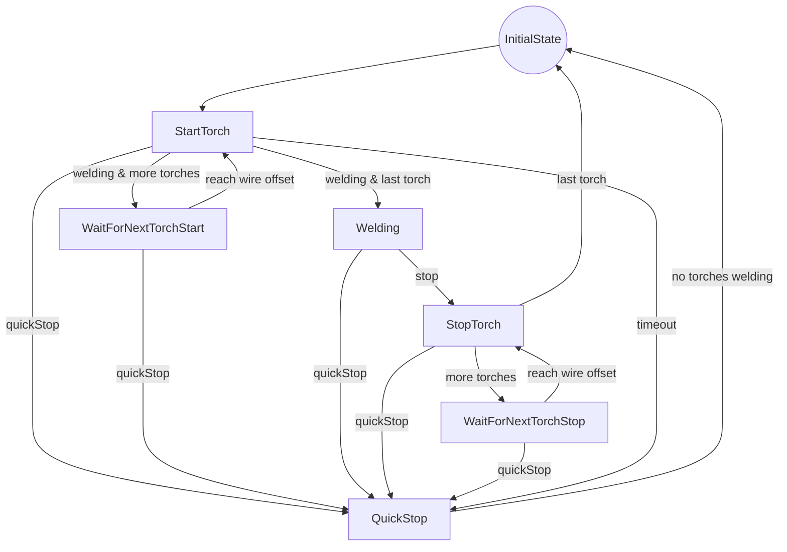

# Weld sequence

```mermaid
flowchart
    InitialState((InitialState))
    StartTorch[StartTorch]
    WaitForNextTorchStart[WaitForNextTorchStart]
    Welding[Welding]
    StopTorch[StopTorch]
    WaitForNextTorchStop[WaitForNextTorchStop]
    QuickStop[QuickStop]

    %% Normal flow
    InitialState --> StartTorch
    StartTorch -->|welding & more torches| WaitForNextTorchStart
    StartTorch -->|welding & last torch| Welding
    WaitForNextTorchStart -->|reach wire offset| StartTorch
    Welding -->|stop| StopTorch
    StopTorch -->|more torches| WaitForNextTorchStop
    StopTorch -->|last torch| InitialState
    WaitForNextTorchStop -->|reach wire offset| StopTorch

    %% Quick stop paths
    StartTorch -->|quickStop| QuickStop
    WaitForNextTorchStart -->|quickStop| QuickStop
    Welding -->|quickStop| QuickStop
    StopTorch -->|quickStop| QuickStop
    WaitForNextTorchStop -->|quickStop| QuickStop

    %% Timeout now also goes to QuickStop
    StartTorch -->|timeout| QuickStop

    %% QuickStop recovery
    QuickStop -->|no torches welding| InitialState

```
