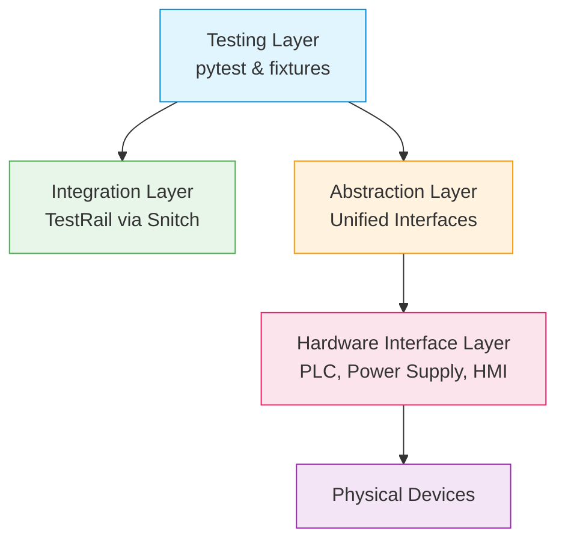
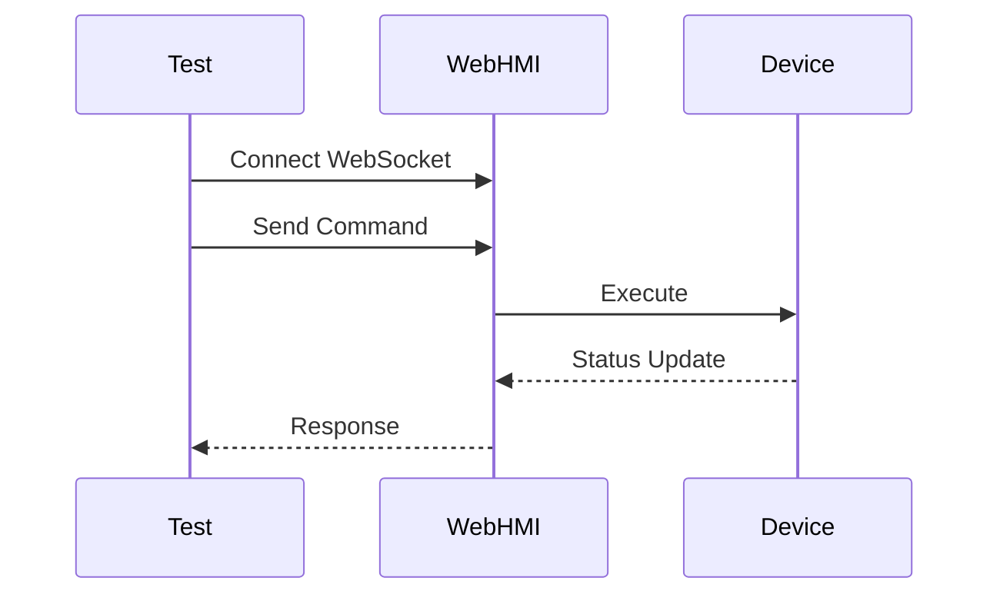
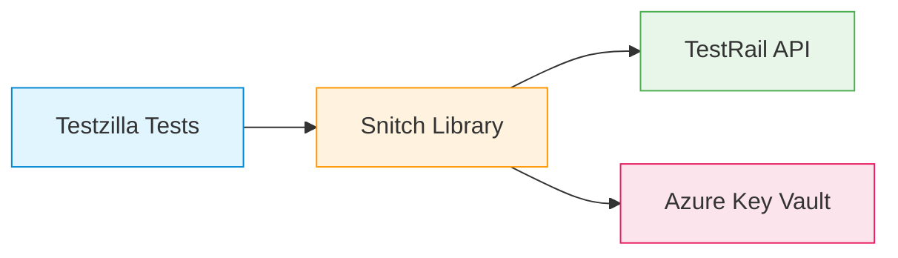
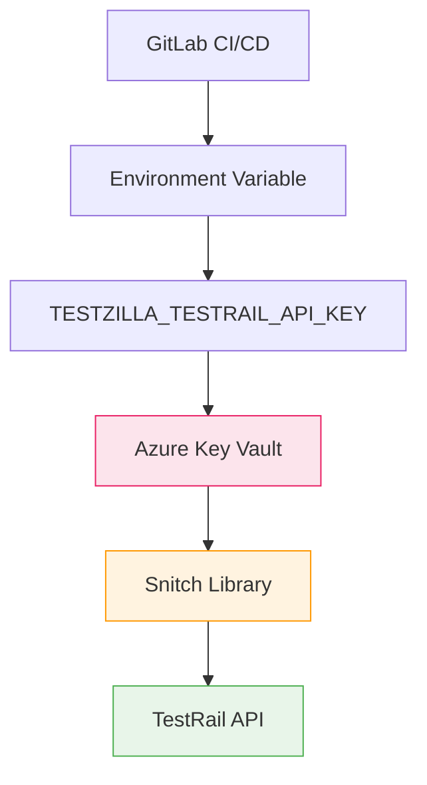
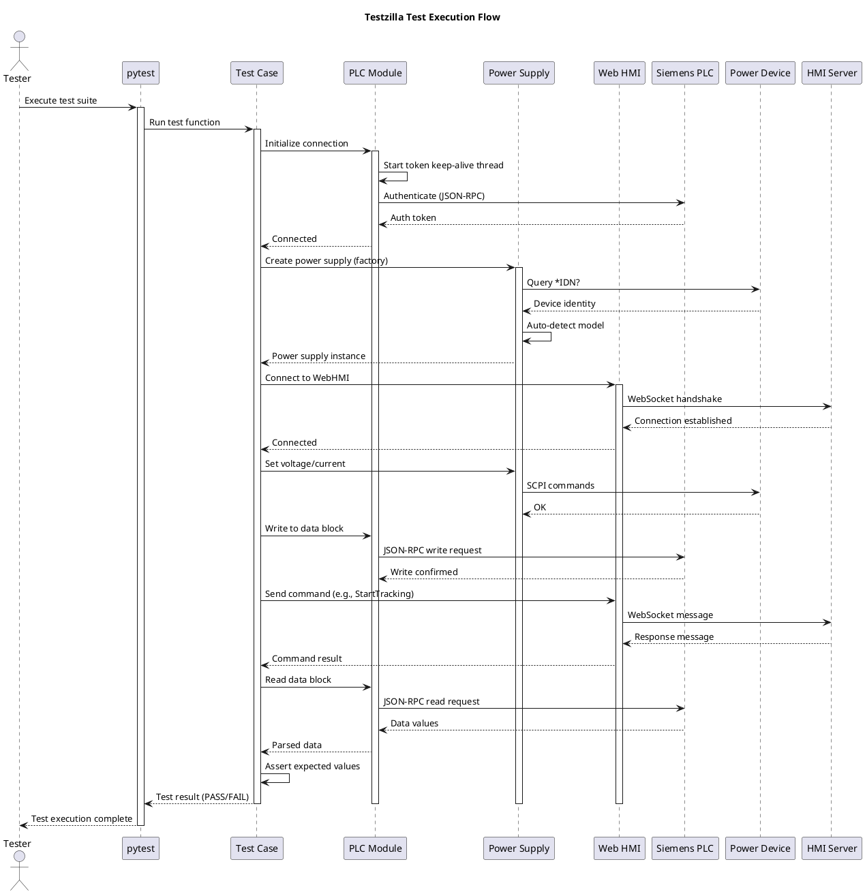
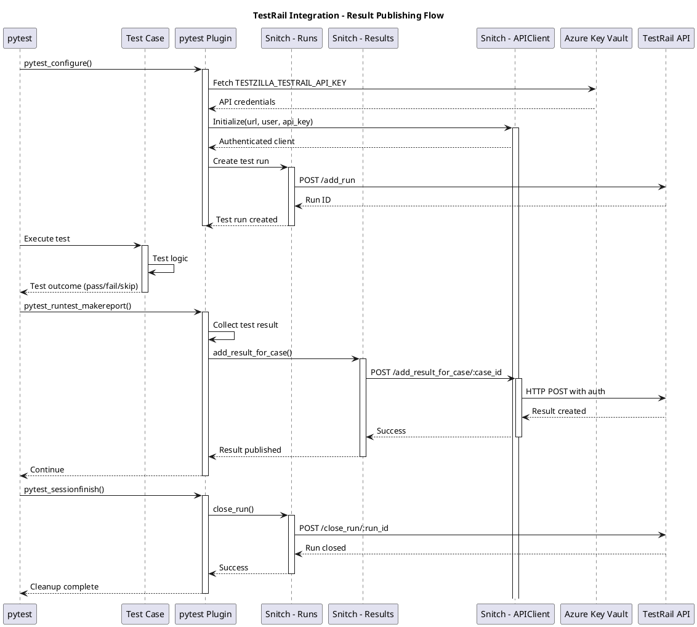
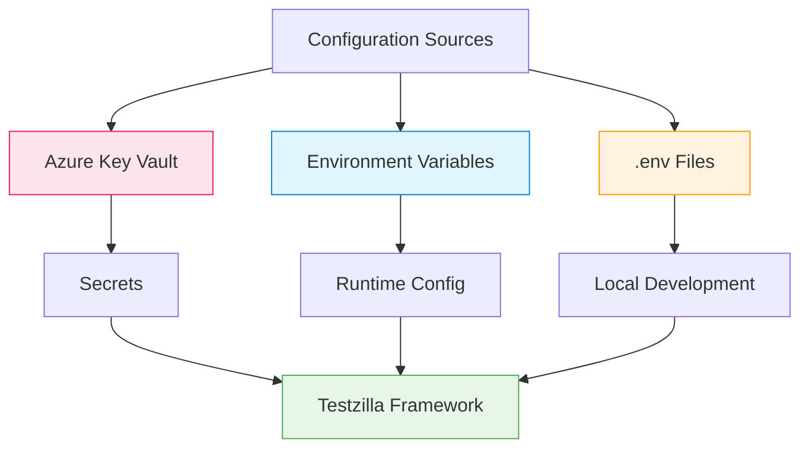

# 🦖 Testzilla Test Framework Architecture

<div align="center">

[](https://www.python.org/)
[](https://pytest.org/)
[](https://playwright.dev/)
[](https://www.gurock.com/testrail/)

**Hardware-in-the-Loop Test Automation for Adaptive Weld Systems**

</div>

---

## 📑 Table of Contents

- [🦖 Testzilla Test Framework Architecture](#-testzilla-test-framework-architecture)
   - [📑 Table of Contents](#-table-of-contents)
   - [📖 Introduction](#-introduction)
   - [🏗️ Framework Overview](#️-framework-overview)
   - [🔧 Core Components](#-core-components)
      - [🔌 PLC Communication Layer](#-plc-communication-layer)
      - [⚡ Power Supply Abstraction Layer](#-power-supply-abstraction-layer)
      - [🖥️ Web HMI Interface](#️-web-hmi-interface)
      - [🌐 Remote Host Management](#-remote-host-management)
      - [🎭 UI Testing with Playwright](#-ui-testing-with-playwright)
      - [🛠️ Utility Services](#️-utility-services)
   - [🔗 TestRail Integration](#-testrail-integration)
      - [🕵️ Snitch - TestRail API Library](#️-snitch---testrail-api-library)
   - [📊 Architecture Diagrams](#-architecture-diagrams)
      - [🌍 C4 Context - Testzilla Ecosystem](#-c4-context---testzilla-ecosystem)
      - [📦 C4 Container - Testzilla Framework](#-c4-container---testzilla-framework)
      - [🧩 C4 Component - TestRail Integration](#-c4-component---testrail-integration)
      - [🔄 Sequence Diagram - Test Execution Flow](#-sequence-diagram---test-execution-flow)
      - [📤 Sequence Diagram - TestRail Result Publishing](#-sequence-diagram---testrail-result-publishing)
   - [🎨 Design Patterns](#-design-patterns)
   - [💻 Technology Stack](#-technology-stack)
   - [⚙️ Configuration Management](#️-configuration-management)
   - [📚 References](#-references)

---

## 📖 Introduction

> **Testzilla** is a Hardware-in-the-Loop (HIL) test framework designed for testing the Adaptive Weld System. It provides comprehensive interfaces for controlling and testing various hardware components including PLCs, power supplies, and web-based HMI systems. The framework integrates with TestRail for test management and result reporting.

### 🎯 Key Objectives

- ✅ **Automated Testing** - Comprehensive HIL test automation
- ✅ **Hardware Abstraction** - Unified interfaces for diverse hardware
- ✅ **Test Management** - Seamless TestRail integration
- ✅ **CI/CD Integration** - GitLab pipeline execution
- ✅ **Type Safety** - Strongly typed Python with Pydantic

This document describes the architecture, components, and integration patterns of the Testzilla framework.

---

## 🏗️ Framework Overview

Testzilla is built on **Python 3.12+** and leverages **pytest** as its testing foundation. The framework follows a modular architecture with distinct layers for different hardware interfaces and testing capabilities:



### 🏛️ Architectural Layers

<table>
<tr>
<td width="25%"><b>🧪 Testing Layer</b></td>
<td>pytest-based test execution and management</td>
</tr>
<tr>
<td><b>🔗 Integration Layer</b></td>
<td>TestRail integration via Snitch library</td>
</tr>
<tr>
<td><b>🎨 Abstraction Layer</b></td>
<td>Unified interfaces for different device implementations</td>
</tr>
<tr>
<td><b>🔌 Hardware Interface Layer</b></td>
<td>Direct communication with physical devices</td>
</tr>
</table>

---

## Core Components

### PLC Communication Layer

<div style="background: linear-gradient(135deg, #667eea 0%, #764ba2 100%); padding: 20px; border-radius: 10px; color: white; margin: 10px 0;">

**Module**: [`plc/plc_json_rpc.py`](../test/testzilla/plc/plc_json_rpc.py)

**Protocol**: `JSON-RPC over HTTPS`

</div>

#### ✨ Features

| Feature | Description |
|---------|-------------|
| 🔐 **Authentication** | Token-based session management with auto-refresh |
| 🔄 **Keep-Alive** | Background thread maintains connection |
| 📖 **Read Operations** | Browse and read PLC data blocks |
| ✍️ **Write Operations** | Modify PLC program variables |
| 🎯 **Type Safety** | Pydantic models for data validation |

```python
# Example Usage
from testzilla.plc import PlcJsonRpc

plc = PlcJsonRpc(url="https://plc-ip", token_keep_alive_interval=60)
plc.login(username="user", password="pass")
data = plc.read("DataBlock.Variable")
```

### Power Supply Abstraction Layer

<div style="background: linear-gradient(135deg, #f093fb 0%, #f5576c 100%); padding: 20px; border-radius: 10px; color: white; margin: 10px 0;">

**Module**: [`power_supply/power_supply_factory.py`](../test/testzilla/power_supply/power_supply_factory.py)

**Pattern**: `Factory with Auto-Detection`

</div>

#### 🎛️ Supported Models

| Manufacturer | Model | Interface |
|--------------|-------|----------|
| **AIMTTI** | CPX200DP | SCPI/TCP |
| **Keysight** | E36234A | SCPI/TCP |

#### ✨ Features

- 🔍 **Auto-Detection** - Identifies device via `*IDN?` query
- 🎨 **Unified Interface** - `AbstractPowerSupply` base class
- 🔒 **Context Manager** - Automatic resource cleanup
- ⚡ **Voltage Control** - Precise voltage setting with validation
- 🔋 **Current Control** - Current limiting and monitoring
- 🛡️ **Protection** - Over-voltage protection settings

```python
# Example Usage
from testzilla.power_supply import PowerSupplyFactory

with PowerSupplyFactory.auto_detect({"host": "192.168.1.100"}) as ps:
    ps.set_voltage(24.0, output=1)
    ps.set_current(2.0, output=1)
    ps.enable_output(1)
```

### Web HMI Interface

<div style="background: linear-gradient(135deg, #4facfe 0%, #00f2fe 100%); padding: 20px; border-radius: 10px; color: white; margin: 10px 0;">

**Module**: [`adaptio_web_hmi/adaptio_web_hmi.py`](../test/testzilla/adaptio_web_hmi/adaptio_web_hmi.py)

**Protocol**: `WebSocket (WSS)`

</div>

#### ✨ Capabilities

| Category | Operations |
|----------|------------|
| 🎯 **Calibration** | Laser-to-torch, weld object calibration |
| 📊 **Status** | Activity status, slides position |
| 🎮 **Control** | Kinematics control, tracking commands |
| 📡 **Monitoring** | Real-time position and status updates |

#### 🔄 Communication Flow



### Remote Host Management

<div style="background: linear-gradient(135deg, #fa709a 0%, #fee140 100%); padding: 20px; border-radius: 10px; color: white; margin: 10px 0;">

**Module**: [`remote_comm/remote_host.py`](../test/testzilla/remote_comm/remote_host.py)

**Technology**: `Fabric (Paramiko)`

</div>

#### 🚀 Operations

| Operation | Protocol | Timeout |
|-----------|----------|--------|
| 💻 **Command Execution** | SSH | 60s (configurable) |
| 📁 **File Sync** | rsync over SSH | Configurable |
| 🔑 **Sudo Operations** | SSH with password | 60s |
| 🔌 **Connection** | SSH | 30s |

#### ✨ Features

- ⚡ **Fast Execution** - Efficient command execution
- 🔄 **File Sync** - Bidirectional rsync support
- 🔐 **Secure** - Password and key-based authentication
- ⏱️ **Timeout Control** - Prevents hanging operations
- 🔗 **Connection Pooling** - Reuses connections efficiently

### UI Testing with Playwright

<div style="background: linear-gradient(135deg, #a8edea 0%, #fed6e3 100%); padding: 20px; border-radius: 10px; color: white; margin: 10px 0;">

**Module**: [`utility/playwright.py`](../test/testzilla/utility/playwright.py)

**Framework**: `Playwright`

</div>

#### 🌐 Browser Support

| Browser | Status | Use Case |
|---------|--------|----------|
| 🔵 **Chromium** | ✅ Supported | Primary testing browser |
| 🦊 **Firefox** | ✅ Supported | Cross-browser validation |

#### 🎬 Features

- 🧪 **pytest Integration** - Native fixture support
- 👁️ **Headed/Headless** - Visual debugging or CI mode
- 🎥 **Video Recording** - Test execution capture
- 📸 **Auto Screenshots** - Failure debugging
- 📁 **Artifact Management** - Organized test outputs
- 🏗️ **Page Objects** - Maintainable test structure

```python
# Example Usage
def test_hmi_login(playwright_manager):
    page = playwright_manager.new_page()
    page.goto("https://hmi-url")
    page.fill("#username", "admin")
    page.click("#login")
    assert page.is_visible(".dashboard")
```

### Utility Services

<div style="background: linear-gradient(135deg, #ffecd2 0%, #fcb69f 100%); padding: 20px; border-radius: 10px; color: #333; margin: 10px 0;">

**Location**: [`utility/`](../test/testzilla/utility/)

</div>

| Utility | Purpose | Protocol |
|---------|---------|----------|
| 🔌 **WebSocket Client** | Async/sync WebSocket communication | WebSocket |
| 📁 **File System** | File operations and path management | OS APIs |
| 🔧 **Socket Manager** | Low-level socket operations | TCP/UDP |
| 🔄 **Rsync** | Efficient file synchronization | rsync |

---

## 🔗 TestRail Integration

### 🕵️ Snitch - TestRail API Library

<div style="background: linear-gradient(135deg, #72edf2 0%, #5151e5 100%); padding: 25px; border-radius: 15px; color: white; margin: 15px 0; box-shadow: 0 8px 16px rgba(0,0,0,0.2);">

**Snitch** is the TestRail integration library used by Testzilla for test management and result reporting.

📍 **Location**: [`container_files/snitch/`](../container_files/snitch/)

</div>

#### 🌟 Key Features



| Feature | Description |
|---------|-------------|
| 📝 **CRUD Operations** | Full create, read, update, delete for TestRail entities |
| 🎯 **Type Safety** | Object-oriented, typed Python API |
| ⚙️ **Configuration** | Environment-based setup |
| 🔄 **Auto Publishing** | pytest integration for automatic result reporting |

#### 📦 Supported Entities

<table>
<tr>
<td width="20%"><b>📁 Projects</b></td>
<td>Test project management</td>
</tr>
<tr>
<td><b>📚 Suites</b></td>
<td>Test suite organization</td>
</tr>
<tr>
<td><b>📂 Sections</b></td>
<td>Hierarchical test organization</td>
</tr>
<tr>
<td><b>📄 Cases</b></td>
<td>Individual test case definitions</td>
</tr>
<tr>
<td><b>🏃 Runs</b></td>
<td>Test execution runs</td>
</tr>
<tr>
<td><b>✅ Results</b></td>
<td>Test execution results and status</td>
</tr>
</table>

#### 🔐 Authentication



- 🔑 API Key-based authentication
- ☁️ Credentials stored in **Azure Key Vault**
- 🌍 Environment variable: `TESTZILLA_TESTRAIL_API_KEY`

---

## 📊 Architecture Diagrams

> The following diagrams illustrate the Testzilla framework architecture using the **C4 Model** and **UML sequence diagrams**.

### 🌍 C4 Context - Testzilla Ecosystem

<div style="border-left: 4px solid #0288d1; padding-left: 15px; margin: 10px 0;">

**Level**: System Context

**Focus**: How Testzilla interacts with users and external systems

</div>

```plantuml
@startuml
!include https://raw.githubusercontent.com/plantuml-stdlib/C4-PlantUML/master/C4_Context.puml

title System Context Diagram - Testzilla Test Framework

Person(tester, "Test Engineer", "Develops and executes automated tests for HIL systems")
Person(developer, "Developer", "Uses test results for debugging and validation")

System(testzilla, "Testzilla Framework", "Python-based HIL test automation framework for the Adaptive Weld System")

System_Ext(testrail, "TestRail", "Test management and reporting platform")
System_Ext(gitlab, "GitLab CI/CD", "Continuous integration and test execution")
System_Ext(plc, "Siemens PLC", "Programmable Logic Controller running welding control logic")
System_Ext(power_supply, "Power Supply", "Programmable power supplies for hardware stimulus")
System_Ext(web_hmi, "Adaptio Web HMI", "Web-based Human Machine Interface")
System_Ext(remote_hosts, "Remote Test Systems", "Remote HIL rigs and test environments")

Rel(tester, testzilla, "Writes and executes tests", "pytest")
Rel(developer, testrail, "Reviews test results")
Rel(testzilla, testrail, "Publishes test results", "HTTPS/REST API")
Rel(testzilla, plc, "Controls and monitors", "JSON-RPC/HTTPS")
Rel(testzilla, power_supply, "Controls voltage/current", "SCPI/Socket")
Rel(testzilla, web_hmi, "Sends commands", "WebSocket")
Rel(testzilla, remote_hosts, "Executes commands", "SSH/rsync")
Rel(gitlab, testzilla, "Triggers test execution", "GitLab Runner")
Rel(gitlab, testrail, "Fetches API credentials", "CI/CD Variables")

@enduml
```

### 📦 C4 Container - Testzilla Framework

<div style="border-left: 4px solid #ff9800; padding-left: 15px; margin: 10px 0;">

**Level**: Container

**Focus**: Internal modules and their responsibilities

</div>

```plantuml
@startuml
!include https://raw.githubusercontent.com/plantuml-stdlib/C4-PlantUML/master/C4_Container.puml

title Container Diagram - Testzilla Framework

Person(tester, "Test Engineer")

System_Boundary(testzilla, "Testzilla Framework") {
    Container(pytest, "pytest", "Python Testing Framework", "Test execution engine and fixture management")
    
    Container(plc_comm, "PLC Communication", "Python Module", "JSON-RPC client for Siemens PLC communication with token management")
    
    Container(power_supply, "Power Supply Manager", "Python Module", "Factory-based abstraction for multiple power supply models")
    
    Container(web_hmi, "Web HMI Client", "Python Module", "WebSocket client for Adaptio Web HMI communication")
    
    Container(remote_mgr, "Remote Host Manager", "Python Module", "SSH/rsync-based remote system control")
    
    Container(playwright_mgr, "Playwright Manager", "Python Module", "Browser automation for UI testing")
    
    Container(utilities, "Utilities", "Python Modules", "WebSocket, file system, socket helpers")
    
    Container(snitch, "Snitch", "Python Library", "TestRail API client for test management and result publishing")
}

System_Ext(plc, "Siemens PLC")
System_Ext(power_devices, "Power Supplies")
System_Ext(hmi, "Web HMI")
System_Ext(remote_sys, "Remote Systems")
System_Ext(browser, "Web Browser")
System_Ext(testrail, "TestRail")

Rel(tester, pytest, "Runs tests")
Rel(pytest, plc_comm, "Uses")
Rel(pytest, power_supply, "Uses")
Rel(pytest, web_hmi, "Uses")
Rel(pytest, remote_mgr, "Uses")
Rel(pytest, playwright_mgr, "Uses")
Rel(pytest, snitch, "Publishes results")

Rel(plc_comm, plc, "JSON-RPC/HTTPS", "Port 443")
Rel(power_supply, power_devices, "SCPI/TCP", "Port 9221")
Rel(web_hmi, hmi, "WebSocket/WSS")
Rel(web_hmi, utilities, "Uses")
Rel(remote_mgr, remote_sys, "SSH/rsync", "Port 22")
Rel(playwright_mgr, browser, "CDP/WebDriver")
Rel(snitch, testrail, "REST API/HTTPS")

@enduml
```

### 🧩 C4 Component - TestRail Integration

<div style="border-left: 4px solid #4caf50; padding-left: 15px; margin: 10px 0;">

**Level**: Component

**Focus**: Detailed TestRail integration architecture

</div>

```plantuml
@startuml
!include https://raw.githubusercontent.com/plantuml-stdlib/C4-PlantUML/master/C4_Component.puml

title Component Diagram - TestRail Integration via Snitch

Container_Boundary(snitch, "Snitch Library") {
    Component(api_client, "TestRailAPIClient", "Python Class", "HTTP client with authentication and request handling")
    
    Component(projects, "Projects", "Python Class", "Project management operations")
    
    Component(suites, "Suites", "Python Class", "Test suite operations")
    
    Component(sections, "Sections", "Python Class", "Test section/hierarchy operations")
    
    Component(cases, "Cases", "Python Class", "Test case CRUD operations")
    
    Component(runs, "Runs", "Python Class", "Test run management")
    
    Component(results, "Results", "Python Class", "Test result publishing and updates")
}

Container_Boundary(testzilla, "Testzilla Framework") {
    Component(pytest_plugin, "pytest Integration", "Python Plugin", "Hooks for automatic result collection")
    
    Component(test_suite, "Test Cases", "pytest Tests", "Actual test implementations")
}

System_Ext(testrail_api, "TestRail REST API")
System_Ext(azure_kv, "Azure Key Vault")
System_Ext(gitlab_vars, "GitLab CI Variables")

Rel(projects, api_client, "Uses")
Rel(suites, api_client, "Uses")
Rel(sections, api_client, "Uses")
Rel(cases, api_client, "Uses")
Rel(runs, api_client, "Uses")
Rel(results, api_client, "Uses")

Rel(api_client, testrail_api, "GET/POST", "HTTPS/Basic Auth")

Rel(pytest_plugin, runs, "Creates test run")
Rel(pytest_plugin, results, "Publishes test results")
Rel(test_suite, pytest_plugin, "Triggers hooks")

Rel(gitlab_vars, azure_kv, "Fetches credentials")
Rel(pytest_plugin, gitlab_vars, "Reads TESTZILLA_TESTRAIL_API_KEY")

@enduml
```

### 🔄 Sequence Diagram - Test Execution Flow

<div style="border-left: 4px solid #e91e63; padding-left: 15px; margin: 10px 0;">

**Type**: Sequence Diagram

**Scenario**: Complete test execution lifecycle with hardware interaction

</div>



### 📤 Sequence Diagram - TestRail Result Publishing

<div style="border-left: 4px solid #9c27b0; padding-left: 15px; margin: 10px 0;">

**Type**: Sequence Diagram

**Scenario**: Automated test result publishing to TestRail

</div>



---

## 🎨 Design Patterns

<div style="background: linear-gradient(135deg, #ffecd2 0%, #fcb69f 100%); padding: 20px; border-radius: 10px; margin: 10px 0;">

The Testzilla framework employs several well-established design patterns:

</div>

| Pattern | Application | Benefit |
|---------|-------------|----------|
| 🏭 **Factory Pattern** | Power supply creation with auto-detection | Flexible device instantiation |
| 🎨 **Abstract Base Class** | Common interface for power supply implementations | Polymorphic device handling |
| 🔒 **Context Manager** | Resource management (PLC, power supply, SSH) | Automatic cleanup |
| 🧵 **Thread-safe Singleton** | PLC token keep-alive background thread | Reliable connection |
| 🔌 **Adapter Pattern** | Unified interface for protocols (JSON-RPC, SCPI, WebSocket) | Protocol abstraction |
| 💉 **Dependency Injection** | pytest fixtures provide configured instances | Testable, modular code |

---

## 💻 Technology Stack

<div style="background: linear-gradient(135deg, #667eea 0%, #764ba2 100%); padding: 20px; border-radius: 10px; color: white; margin: 10px 0;">

### Core Technologies

</div>

| Category | Technology | Purpose |
|----------|------------|---------|
| 🐍 **Core** | Python 3.12+ | Primary language |
| 🧪 **Testing** | pytest, pytest-asyncio, pytest-cov | Test framework and coverage |
| 🎯 **Type Safety** | Pydantic | Data validation and modeling |
| 📡 **HTTP/RPC** | requests | HTTP and JSON-RPC communication |
| 🔌 **WebSocket** | websockets | Real-time bidirectional communication |
| 🌐 **SSH** | Fabric/Paramiko | Remote system control |
| 🎭 **Browser** | Playwright | UI test automation |
| 📝 **Logging** | loguru | Structured logging |

---

## ⚙️ Configuration Management



| Type | Source | Usage |
|------|--------|-------|
| 🔐 **Secrets** | Azure Key Vault (via GitLab CI) | API keys, credentials |
| 🌍 **Environment** | `.env` files and env variables | Configuration parameters |
| 🧪 **Test Data** | pytest fixtures | Dependency injection |

---

## 📚 References

- [ADR-010: pytest as Test Framework](../ADRs/adr-010-pytest-as-test-fw.md)
- [ADR-011: Python in Automation](../ADRs/adr-011-python-in-automation.md)
- [ADR-017: Strongly Typed Python](../ADRs/adr-017-strongly-typed-python.md)
- [ADR-020: Playwright UI Testing](../ADRs/adr-020-playwright-ui-testing.md)
- [HIL System Architecture](./hil-system.md)
- [Snitch README](../container_files/snitch/README.md)
